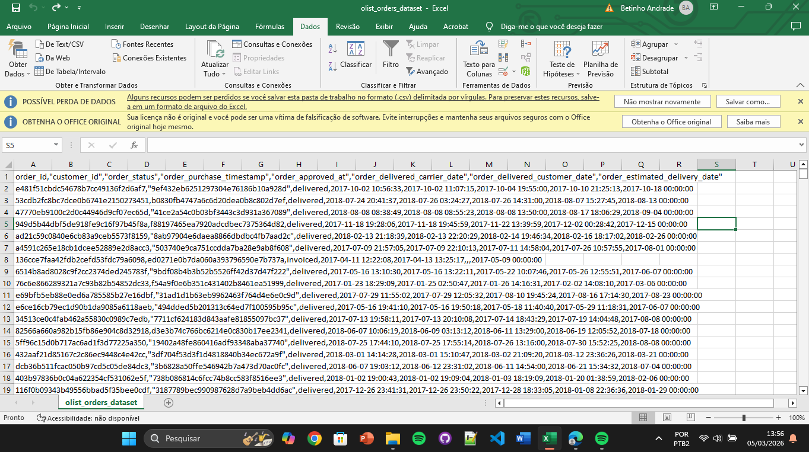
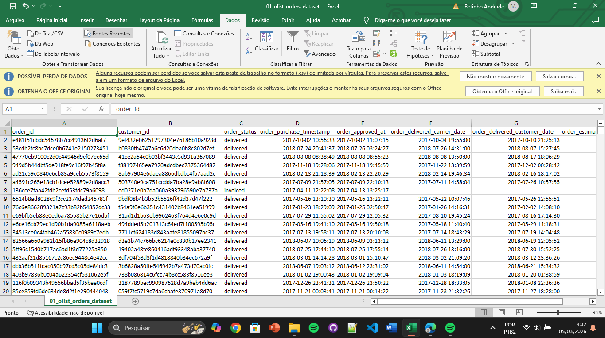
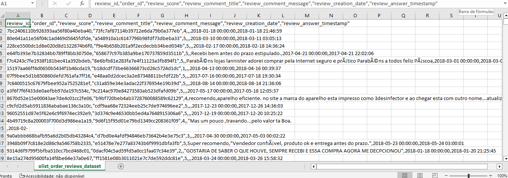
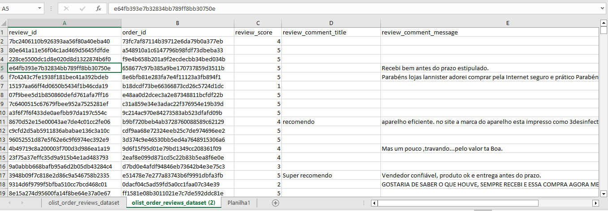
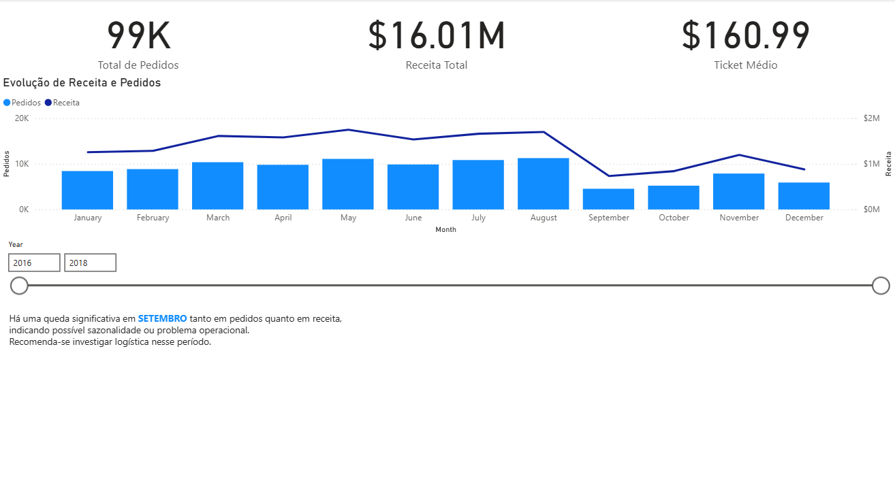
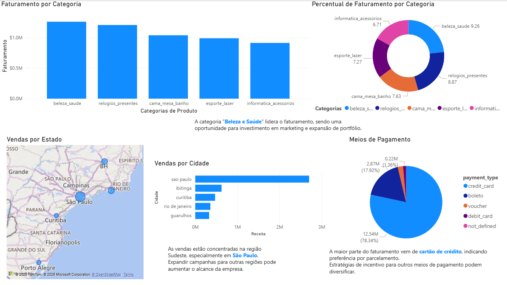

# 📊 Análise de Dados - E-commerce

Este projeto tem como objetivo realizar uma análise exploratória de dados de um e-commerce, utilizando ferramentas como Excel, SQLite e Power BI para gerar insights de negócio.

---

## 🚀 Objetivo

Identificar padrões de vendas, comportamento dos clientes e oportunidades de melhoria no negócio.

---

## 🛠️ Ferramentas utilizadas

- Excel → limpeza e tratamento de dados
- SQLite → consultas e análises com SQL
- Power BI → visualização e criação de dashboard

---

## 📁 Estrutura do Projeto

projeto_ecommerce_analise/
│
├── data/ # Dados brutos e tratados
├── consultas_sql/ # Queries utilizadas na análise
├── dashboard/ # Dashboard Power BI + prints
├── imagens/ # Evidências da limpeza de dados
└── README.md

---

## 📂 Dados

Os dados utilizados neste projeto foram reduzidos para uma amostra devido a limitações de tamanho do GitHub.

O dataset original pode ser encontrado em:
https://www.kaggle.com/datasets/olistbr/brazilian-ecommerce

---

## 🧹 Limpeza e Tratamento de Dados (Excel)

Antes das análises, foi necessário realizar o tratamento dos dados para garantir qualidade e consistência.

### 🔧 Principais problemas encontrados:

- Dados importados em formato CSV com todas as informações em uma única coluna
- Separadores incorretos (vírgulas dentro dos dados)
- Problemas de encoding (acentuação incorreta)
- Campos de data em formato inadequado
- Presença de valores inconsistentes

---

### ✅ Exemplo 1 – Estruturação dos dados

Os dados estavam inicialmente desorganizados, com todas as colunas concentradas em apenas uma.

#### Antes:

#### Depois:

📌 Ações realizadas:
- Separação de colunas utilizando delimitador correto
- Ajuste de cabeçalhos
- Organização do dataset em formato tabular

---

### ✅ Exemplo 2 – Correção de encoding e padronização

Foram identificados problemas de acentuação e inconsistência em campos textuais.

#### Antes:

#### Depois:

📌 Ações realizadas:
- Correção de caracteres especiais (encoding)
- Padronização de textos
- Ajuste de datas para formato adequado
- Limpeza de valores inconsistentes

---

### 🎯 Resultado

Após o tratamento, os dados ficaram estruturados e prontos para análise, garantindo maior confiabilidade nos insights gerados.

---

## 🧠 Análises realizadas (SQL)

Algumas análises feitas utilizando SQL:

- Faturamento por categoria
- Ranking de categorias mais lucrativas
- Análise de faturamento por estado/cidade
- Métodos de pagamento mais utilizados

---

## 📊 Dashboard (Power BI)

O dashboard foi desenvolvido para facilitar a visualização dos principais indicadores:

- Receita total: $16.01M
- Total de pedidos: 99K
- Ticket médio: $160.99

### Visualizações:

---

## 💡 Principais Insights

- A categoria **Beleza e Saúde** lidera o faturamento
- Forte concentração de vendas na região Sudeste (principalmente São Paulo)
- Cartão de crédito representa a maior parte das transações (~78%)
- Queda significativa de vendas em setembro (possível sazonalidade ou problema operacional)

---

## 📈 Possíveis melhorias

- Expandir campanhas para outras regiões
- Incentivar outros métodos de pagamento
- Investigar queda de vendas em setembro

---

## 📌 Conclusão

A análise permitiu identificar padrões importantes de comportamento dos clientes e oportunidades estratégicas para o negócio.

---

## 📬 Contato

- LinkedIn: https://www.linkedin.com/in/gilberto-andrade-394691344/
- Email: gapf@cin.ufpe.br
